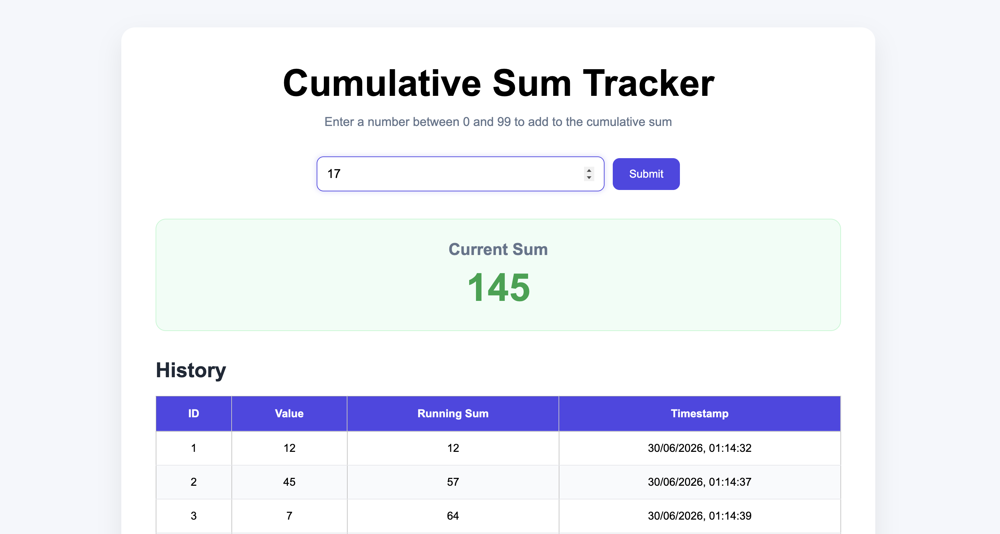
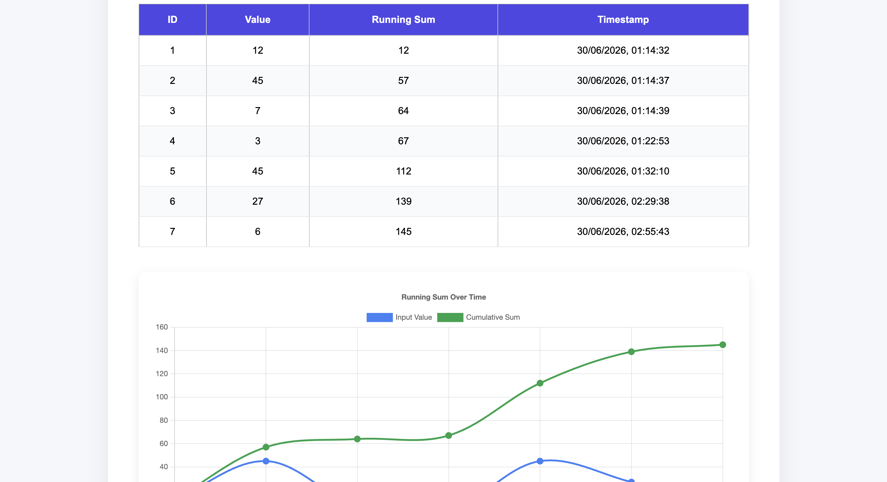
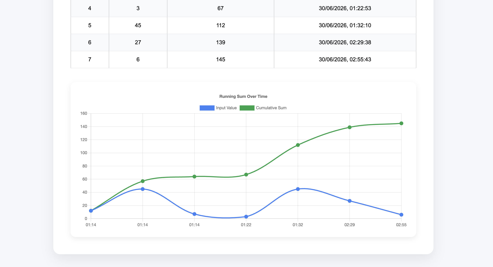
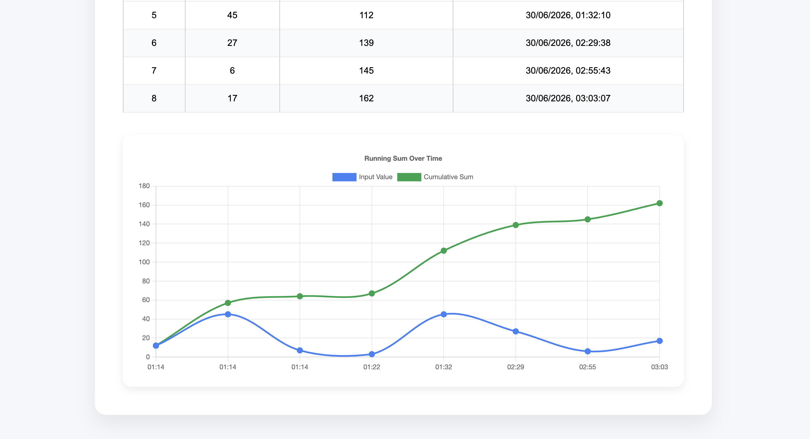

# Cumulative Sum Tracker

A full-stack web application built with **React**, **FastAPI**, and **PostgreSQL** that allows users to enter numbers between **0 and 99**, stores every submission in a database, and maintains a **running cumulative sum**. The application also visualizes the cumulative sum over time using **Chart.js**.

---

## Demo

> Add screenshots or a GIF here after uploading them.

```
screenshots/
├── home.png
├── chart.png
└── swagger.png
```

---

## Features

- Enter numbers between **0 and 99**
- Input validation on both frontend and backend
- Persistent data storage using PostgreSQL
- Running cumulative sum calculation
- Display complete calculation history
- Automatic timestamp for every entry
- Interactive line chart using Chart.js
- REST API built with FastAPI
- Responsive and modern UI
- Environment variable support using `.env`

---

## Tech Stack

### Frontend

- React
- TypeScript
- Vite
- Chart.js
- React Chart.js 2
- CSS

### Backend

- FastAPI
- SQLAlchemy
- Pydantic
- Uvicorn

### Database

- PostgreSQL

### Version Control

- Git
- GitHub

---

## Project Structure

```text
CumulativeSum/
│
├── backend/
│   ├── app/
│   │   ├── crud.py
│   │   ├── database.py
│   │   ├── main.py
│   │   ├── models.py
│   │   ├── schemas.py
│   │   └── ...
│   │
│   ├── requirements.txt
│   └── .env
│
├── frontend/
│   ├── src/
│   │   ├── api/
│   │   ├── components/
│   │   ├── assets/
│   │   ├── App.tsx
│   │   └── ...
│   │
│   ├── package.json
│   └── vite.config.ts
│
├── .gitignore
└── README.md
```

---

## Architecture

```
                React Frontend
                       │
                       │ HTTP Request
                       ▼
                FastAPI Backend
                       │
                Pydantic Validation
                       │
                       ▼
                 CRUD Functions
                       │
                       ▼
                SQLAlchemy ORM
                       │
                       ▼
                 PostgreSQL Database
```

---

## API Endpoints

### Get all records

```
GET /numbers
```

Returns every stored record.

---

### Add a number

```
POST /numbers
```

Request Body

```json
{
  "value": 25
}
```

---

### Get cumulative sum

```
GET /sum
```

Response

```json
{
  "total": 125
}
```

---

## Database Schema

| Column         | Type      |
| -------------- | --------- |
| id             | Integer   |
| value          | Integer   |
| cumulative_sum | Integer   |
| created_at     | Timestamp |

---

## Installation

### 1. Clone the repository

```bash
git clone https://github.com/<Gorachand2501>/cumulative-sum-tracker.git

cd cumulative-sum-tracker
```

---

## Backend Setup

Navigate to the backend folder

```bash
cd backend
```

Create a virtual environment

```bash
python3 -m venv venv
```

Activate it

**macOS/Linux**

```bash
source venv/bin/activate
```

**Windows**

```bash
venv\Scripts\activate
```

Install dependencies

```bash
pip install -r requirements.txt
```

Create a `.env` file

```env
DATABASE_URL=postgresql://postgres:<password>@localhost/cumulative_tracker
```

Run the server

```bash
uvicorn app.main:app --reload
```

Backend

```
http://127.0.0.1:8000
```

Swagger UI

```
http://127.0.0.1:8000/docs
```

---

## Frontend Setup

Navigate to frontend

```bash
cd frontend
```

Install dependencies

```bash
npm install
```

Run

```bash
npm run dev
```

Frontend

```
http://localhost:5173
```

---

## Screenshots

### Home Page



### Table



### Chart




---

## What I Learned

This project helped me learn:

- React component architecture
- TypeScript fundamentals
- State management using Hooks
- REST API development with FastAPI
- SQLAlchemy ORM
- PostgreSQL integration
- CRUD operations
- Request and Response models
- Environment variables
- Chart.js integration
- Git and GitHub workflow
- Building a complete full-stack application

---

## Future Improvements

- User authentication
- Docker support
- AWS deployment
- Alembic database migrations
- Search and filtering
- Export history to CSV
- Dark mode
- Unit and integration tests

---

## Author

**Gorachand Mondal**

GitHub: https://github.com/Gorachand2501
